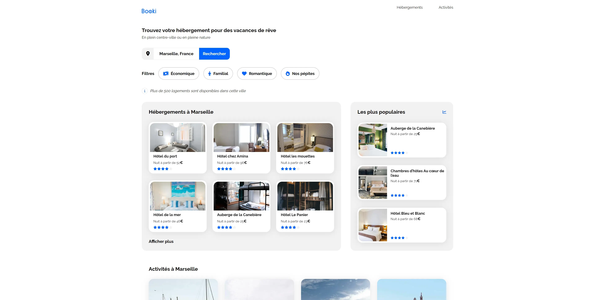

# Booki - Vacation Accommodation Finder

Discover your dream vacation accommodations and explore exciting activities with Booki. Your gateway to finding the perfect getaway!

## Table of Contents

- [Description](#description)
- [Installation](#installation)
- [Usage](#usage)
- [Technologies Used](#technologies-used)
- [Contact](#contact)

## Description

Booki is a static web page created as part of my web developer training. It simulates a startup website designed to help users find vacation accommodations for their ideal getaway. Users can search for accommodations, explore popular activities, and get inspired for their next vacation.

## Installation

1. Clone the repository: `git clone https://github.com/Arkodarkk/Booky_Home_Page.git`
2. Navigate to the project directory: `cd Booky_Home_Page`

## Usage

1. Open the `index.html` file in your web browser.

## Technologies Used

- HTML
- CSS
- Font Awesome icons

## Contact

If you have any questions or feedback, feel free to reach out:

- Email: codecrushcontact@gmail.com
- GitHub: [Arkodarkk](https://github.com/Arkodarkk)

---

Feel free to customize the content as needed. This README structure will provide a clear and concise presentation of your Booki project on GitHub.
